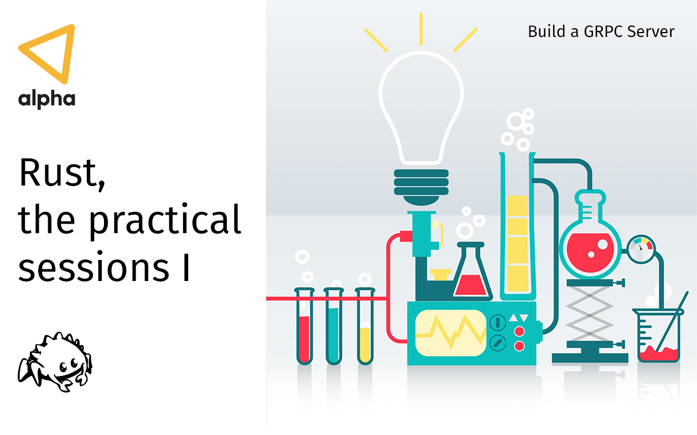

# 1 - Build a gRPC server

## Requirements

- Be sure to have the latest version of [Rust installed](https://www.rust-lang.org/tools/install).
- In case we get to the part of getting some data from a database (which I hope so), you will also need to have [PostgreSQL installed](https://www.postgresql.org/download/).
- Install [rust-analyzer in your VSCode](https://marketplace.visualstudio.com/items?itemName=matklad.rust-analyzer).
- Install grpcurl: `brew install grpcurl`.
- Optional, install [vscode-proto3](https://marketplace.visualstudio.com/items?itemName=zxh404.vscode-proto3) in case you want syntax coloring and intellisense for your proto files.
- Optional, just for debugging purposes, install [CodeLLDB in your VSCode](https://marketplace.visualstudio.com/items?itemName=vadimcn.vscode-lldb)

## What we're going to do

- Verify that everyone has the correct setup before beginning.
- Create a project using Cargo.
- Create a proto file.
- Introduction to dependency management.
- Introduction to build scripts and build dependencies.
- Write a simple gRPC server.
- Usage of the dotenv crate.
- Introduction to the SQLx crate.
- Write a simple interceptor.
- Verify that everything works as expected.

## What we'll see along the way

- Cargo basics
- gRPC
- Dependency management
- Inmutability by default
- Option / Result types
- Error handling
- Module visibility
- Traits
- Async/Await
- How to use the From trait

### Attributions

Lab image by [freepik.com](https://www.freepik.com/free-photos-vectors/background)
