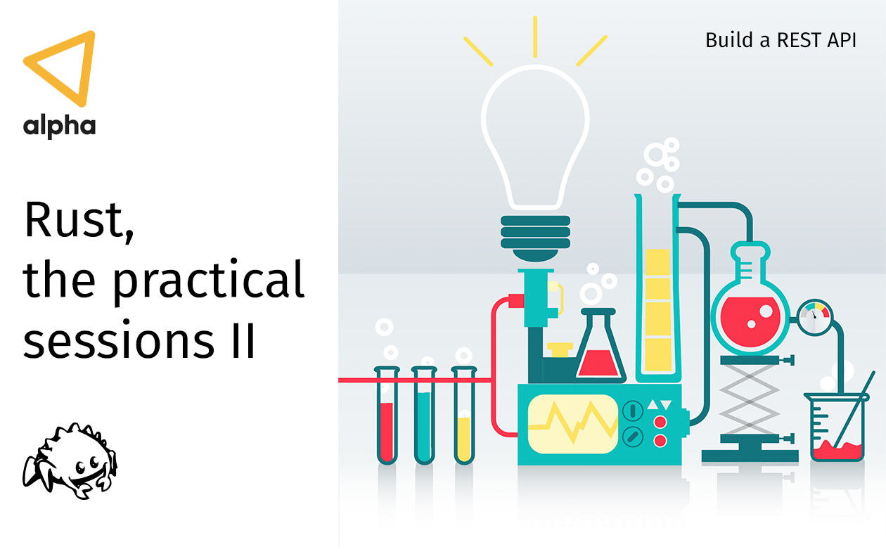

# 2 - Build a REST API

## Requirements

- Be sure to have the latest version of [Rust installed](https://www.rust-lang.org/tools/install).
- In case we get to the part of getting some data from a database (which I hope so), you will also need to have [PostgreSQL installed](https://www.postgresql.org/download/).
- Install [rust-analyzer in your VSCode](https://marketplace.visualstudio.com/items?itemName=matklad.rust-analyzer).
- Install [Postman](https://www.postman.com/) or [curl](https://curl.haxx.se/download.html).
- Optional, just for debugging purposes, install [CodeLLDB in your VSCode](https://marketplace.visualstudio.com/items?itemName=vadimcn.vscode-lldb)

## What we're going to do

- Verify that everyone has the correct setup before beginning.
- Create a project using Cargo.
- Introduction to dependency management.
- Write a healh-check endpoint.
- Write a simple REST API.
- Usage of the dotenv crate.
- Usage of middlewares
- Introduction to the SQLx crate.
- Introduction to the Tokio Tracing crate.
- Introduction to actix-web-prom crate
- Testing
- Verify that everything works as expected.

## What we'll see along the way

- Cargo basics
- REST API
- Dependency management
- Inmutability by default
- Option / Result types
- Error handling
- Module visibility
- Traits
- Async/Await
- Logging
- Metrics
- Distributed tracing
- Macros
- Tests with Mockall

## Postman configuration

In the **assets** folder your find a [json file](/02-rest-api/assets/postman.json) that you can import into your Postman client.

### Attributions

Lab image by [freepik.com](https://www.freepik.com/free-photos-vectors/background)
