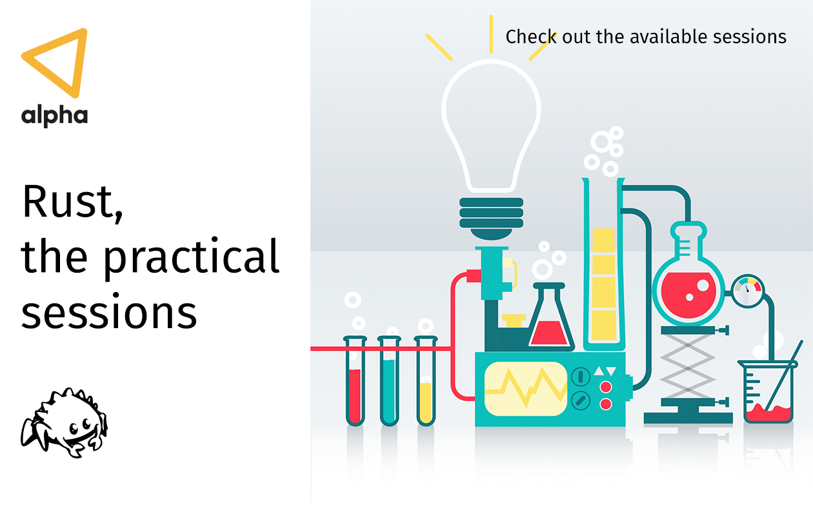

# Rust, the practical sessions

This is just an attempt to group some basic use cases that may help to introduce [Rust](https://www.rust-lang.org/) to developers who are not yet familiar with the language.

Use it at your own discretion!

Hopefully, this effort will enable some of the devs at [Alpha](https://alpha.company) to start using [Rust](https://www.rust-lang.org/) on a regular basis ;D

## Sessions

- [01 - Build a gRPC server](/01-grpc-server/)
- [02 - Build a REST API](/02-rest-api/)
